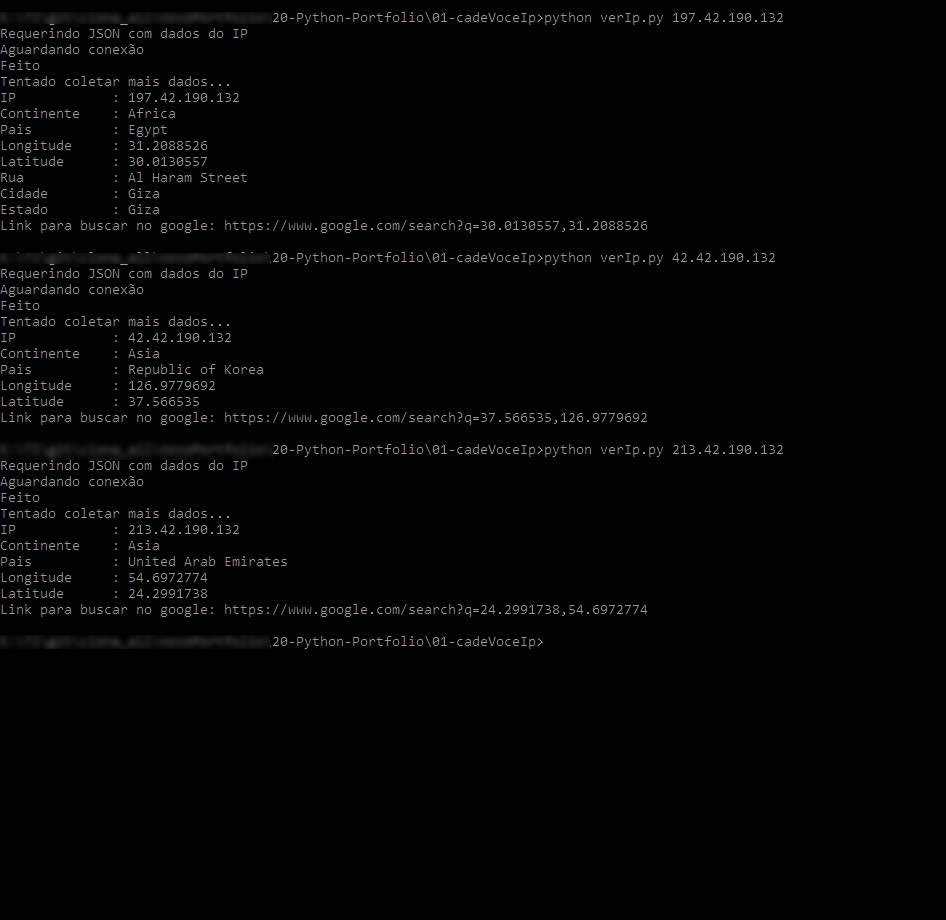

<h1> verIp.py </h1>

  simples app que busca a Geolocalização do IP!
  
<h4>python verIp.py (ENDEREÇO_DE_IP)</h4>
  
  Usando a lib requests para conseguir informações basicas do IP a partir de um arquivo JSON, 
  resgatamos além do Pais e Continente obtemos Latitude e Longitude, e com esses dados fazemos uma nova busca mais refinada.

Usando a lib: 'geopy' para tentar resgatar informações exatas de local como Cidade e até mesmo Rua. (Aproximadamente) 

