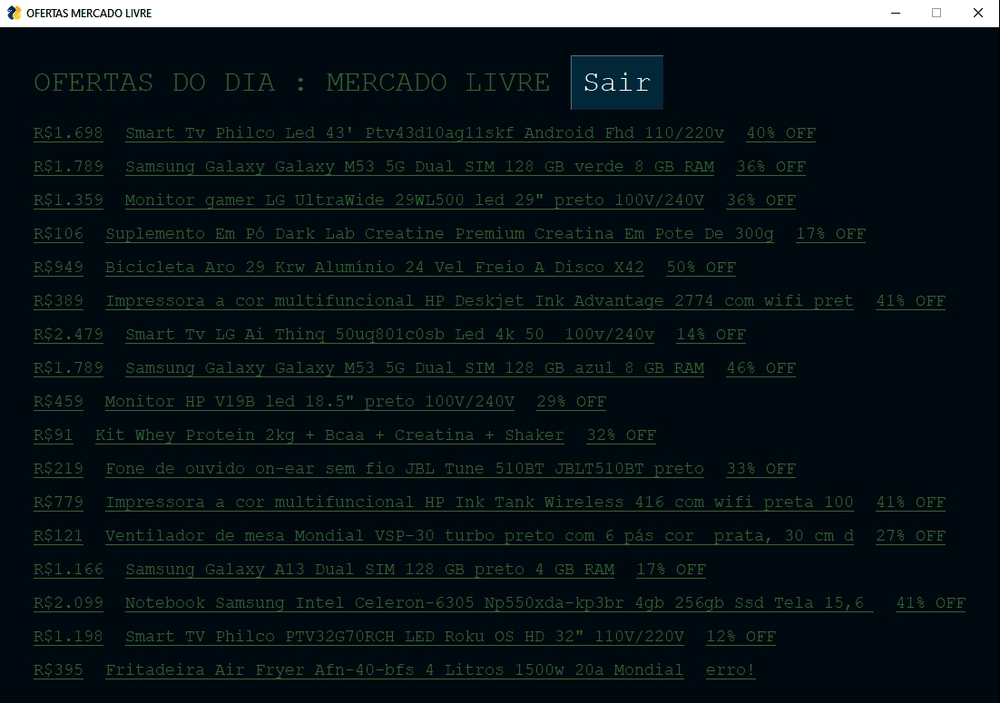

#Ofertas do dia do mercado livre

<ul>
  <li>Carrega a página de ofertas do Mercado Livre usando a lib request.</li>
  <li>Extrai a informação desejada desse request usando a lib BeautifulSoup </li>
  <li>Mostra uma lista com o resultado das ofertas, cada uma com o link direto para o produto. Usando a lib PySimpleGui</li>
 </ul>
  
 #ScreenShot

